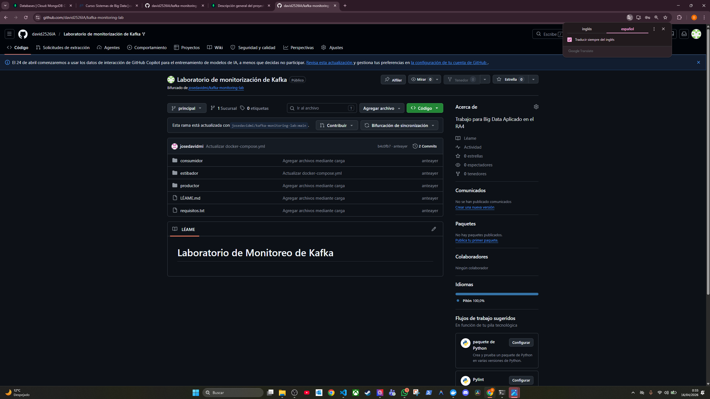
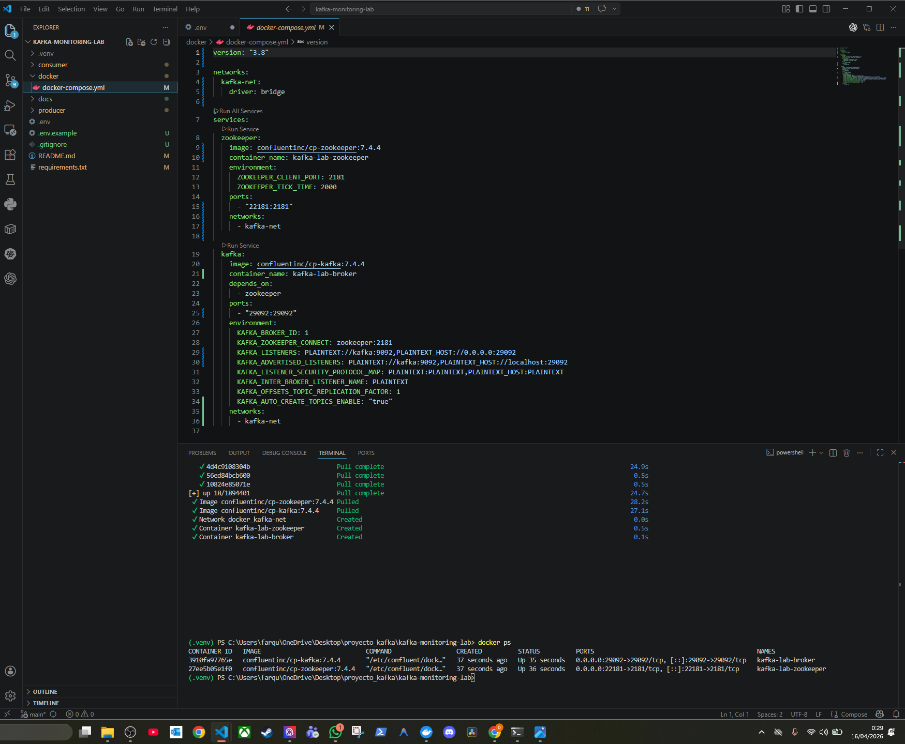
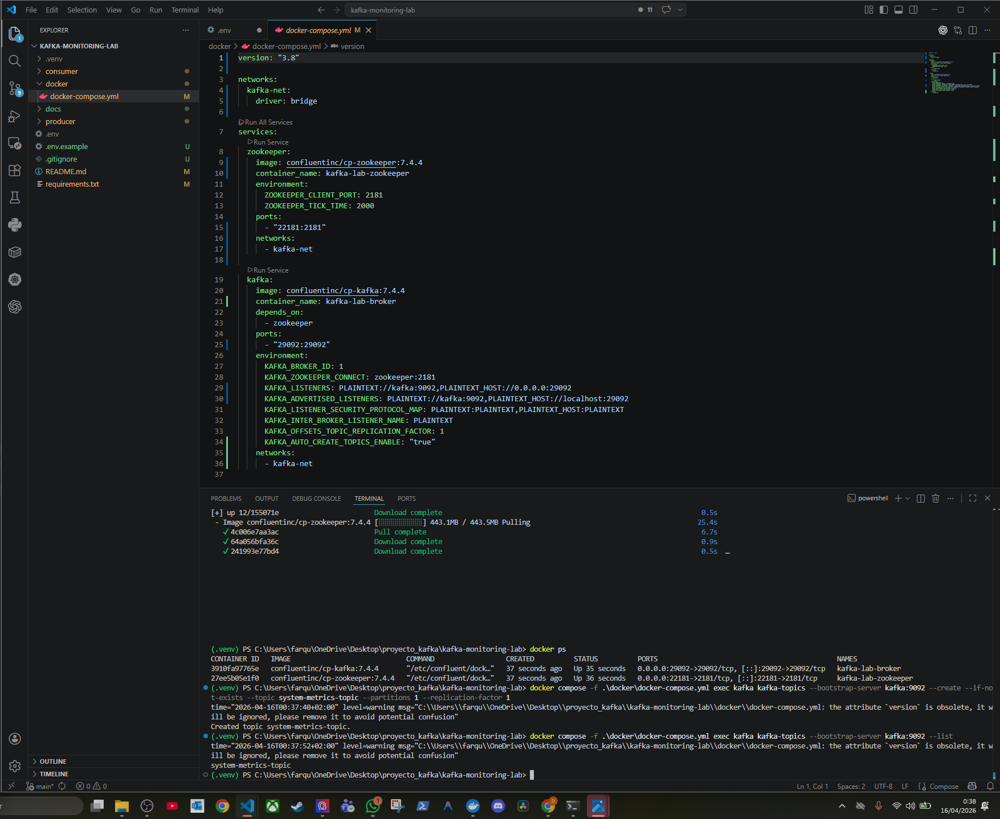
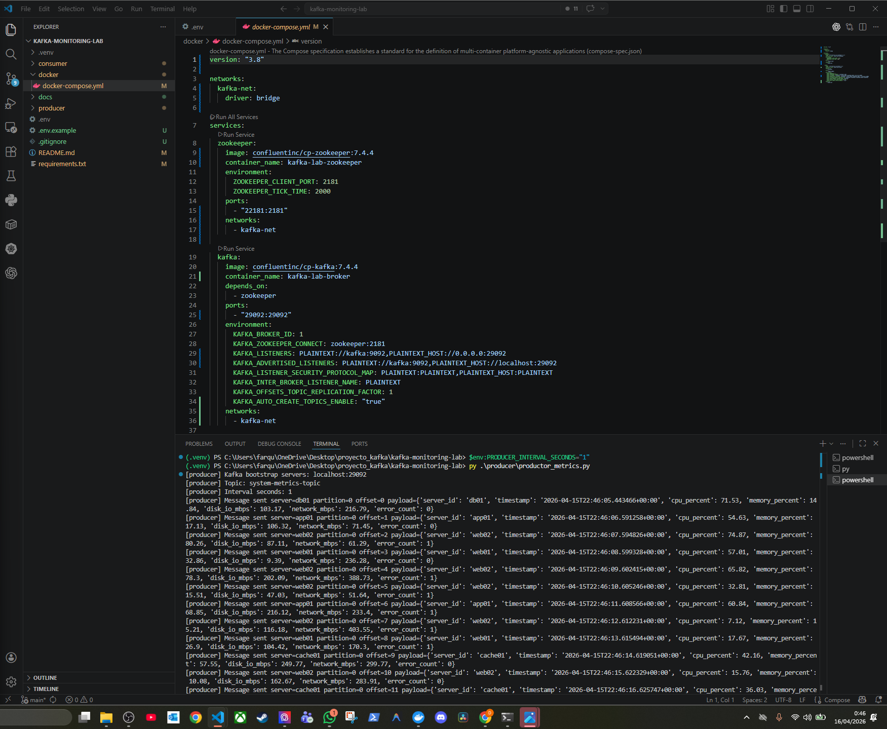
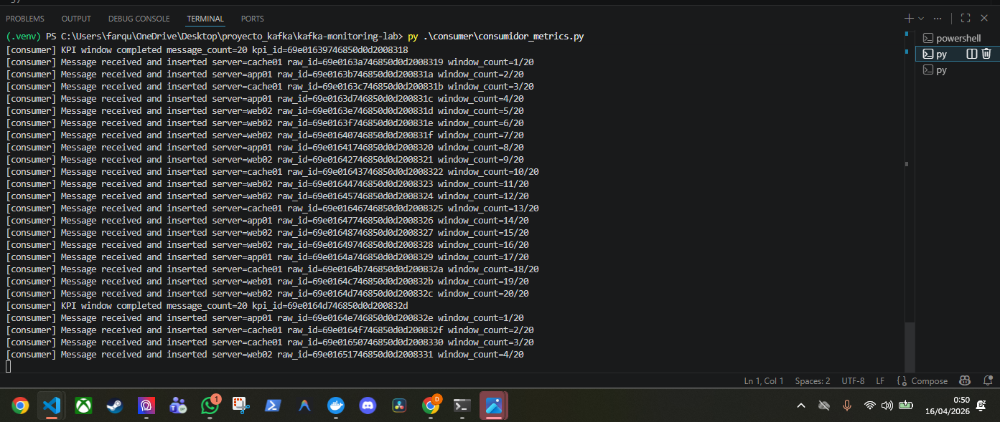
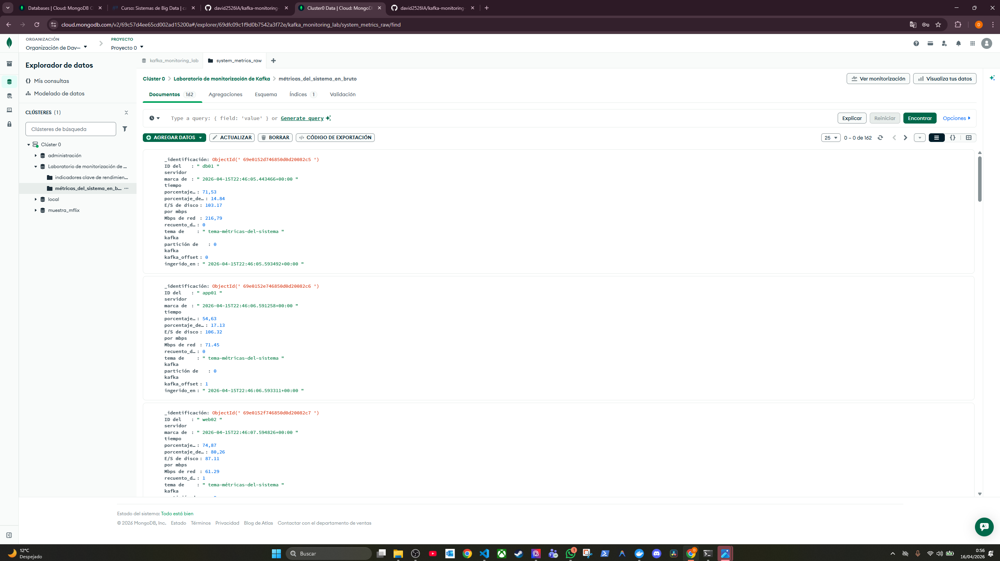
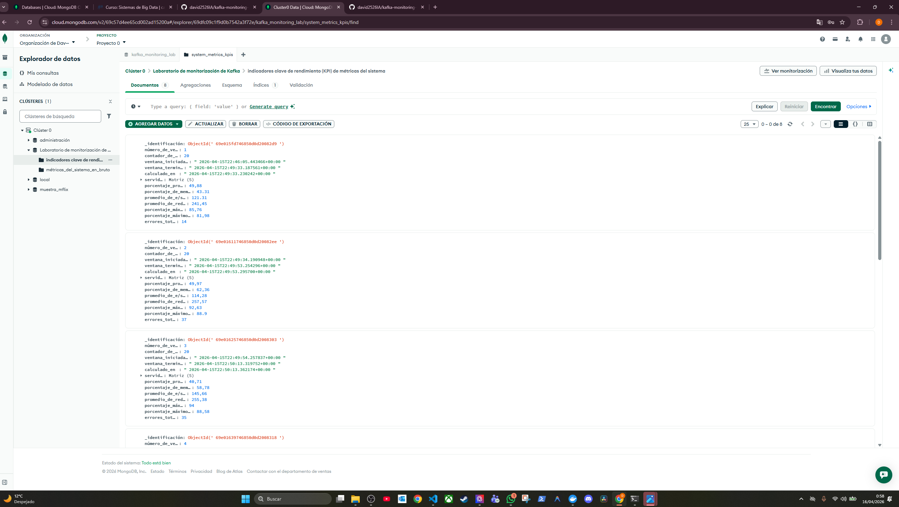
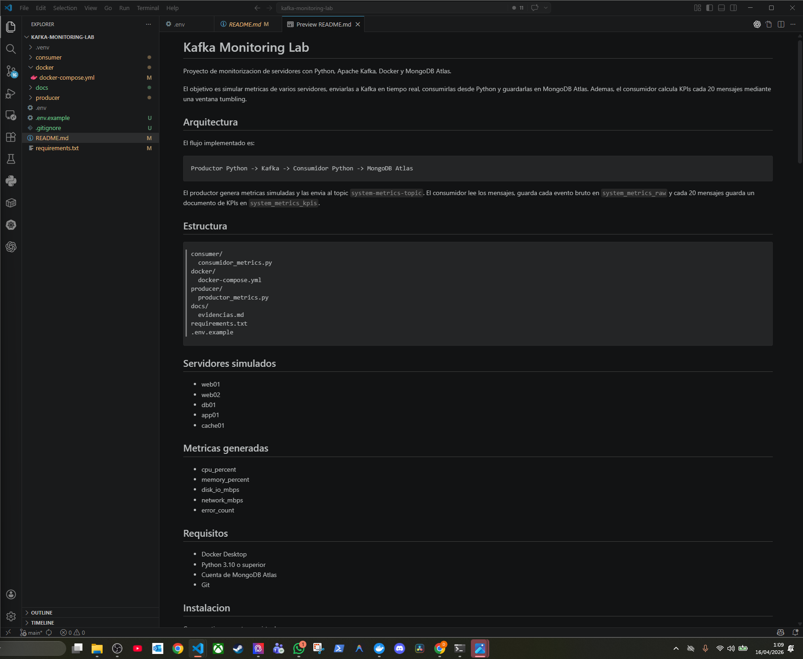
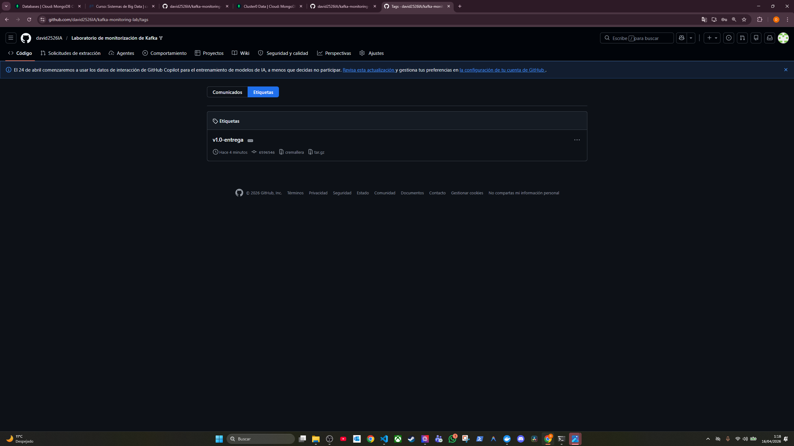

# Evidencias de funcionamiento

Este documento recoge las capturas principales del proyecto y explica que demuestra cada una dentro del flujo:

```text
Productor Python -> Kafka -> Consumidor Python -> MongoDB Atlas
```

## 1. Fork del repositorio



Esta captura demuestra que el trabajo se realizo sobre un fork propio del repositorio base. Es importante porque el enunciado exige trabajar sobre una copia personal y entregar el enlace al repositorio final.

## 2. Kafka arrancado con Docker



La captura muestra los contenedores de Kafka y Zookeeper levantados con Docker Compose. Esta evidencia confirma que el entorno de mensajeria esta disponible localmente antes de ejecutar productor y consumidor.

Contenedores esperados:

```text
kafka-lab-broker
kafka-lab-zookeeper
```

## 3. Topic de Kafka creado



La captura evidencia que el topic `system-metrics-topic` existe en Kafka. Este topic es el canal por el que el productor envia las metricas y el consumidor las recibe.

Comando usado:

```powershell
docker compose -f .\docker\docker-compose.yml exec kafka kafka-topics --bootstrap-server kafka:9092 --create --if-not-exists --topic system-metrics-topic --partitions 1 --replication-factor 1
```

## 4. Productor enviando metricas



Esta captura demuestra que `producer/productor_metrics.py` esta generando metricas simuladas y enviandolas correctamente a Kafka. En la salida se observa el servidor simulado, la particion, el offset y el contenido del mensaje.

Campos generados por el productor:

- `server_id`
- `timestamp`
- `cpu_percent`
- `memory_percent`
- `disk_io_mbps`
- `network_mbps`
- `error_count`

## 5. Consumidor recibiendo e insertando



La captura muestra que `consumer/consumidor_metrics.py` esta conectado a Kafka y MongoDB Atlas. Por cada mensaje recibido, el consumidor inserta un documento RAW y acumula mensajes hasta completar una ventana de 20 registros.

Cuando se completa la ventana, el consumidor genera un documento KPI y lo inserta en la coleccion `system_metrics_kpis`.

## 6. Datos RAW en MongoDB Atlas



Esta evidencia confirma que los mensajes individuales recibidos desde Kafka se guardan en MongoDB Atlas dentro de la coleccion `system_metrics_raw`.

Cada documento RAW contiene la metrica original y metadatos de ingesta:

- `kafka_topic`
- `kafka_partition`
- `kafka_offset`
- `ingested_at`

## 7. KPIs en MongoDB Atlas



La captura demuestra que el consumidor calcula e inserta documentos agregados en `system_metrics_kpis`. Cada documento KPI resume una ventana tumbling de 20 mensajes.

KPIs calculados:

- `message_count`
- `avg_cpu_percent`
- `avg_memory_percent`
- `avg_disk_io_mbps`
- `avg_network_mbps`
- `max_cpu_percent`
- `max_memory_percent`
- `total_errors`
- `window_started_at`
- `window_ended_at`

## 8. README documentado



Esta captura muestra el README del repositorio documentado. El README incluye objetivo, arquitectura, instalacion, configuracion, comandos de ejecucion, MongoDB Atlas, KPIs, evidencias y entrega.

## 9. Tag final de entrega



La captura evidencia que el tag obligatorio `v1.0-entrega` esta creado y disponible en GitHub. Este tag identifica la version final entregada del proyecto.

## Resumen de evidencias

| Evidencia | Que demuestra |
|---|---|
| Fork | Trabajo realizado sobre repositorio propio |
| Docker | Kafka y Zookeeper arrancados |
| Topic | Canal `system-metrics-topic` creado |
| Productor | Envio de metricas simuladas a Kafka |
| Consumidor | Lectura de Kafka, insercion RAW y calculo KPI |
| MongoDB RAW | Persistencia de eventos individuales |
| MongoDB KPI | Persistencia de agregados cada 20 mensajes |
| README | Documentacion completa del proyecto |
| Tag | Version final de entrega creada en GitHub |

## Conclusiones

Las evidencias cubren el flujo completo del proyecto: configuracion del repositorio, arranque del entorno, creacion del topic, ejecucion del productor, ejecucion del consumidor, persistencia en MongoDB Atlas y cierre de entrega con tag.
